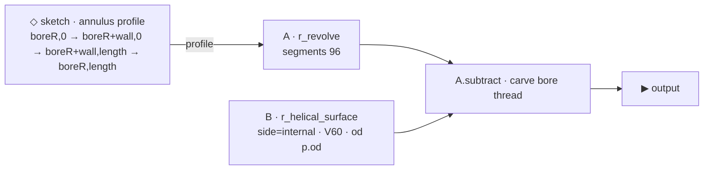

# box_thread

> INTERNAL thread demo (a box) — a sketched tube with a helical thread carved
> into its bore by the [`r_helical_surface`](r_helical_surface.md) engine
> (`side=internal`). Coarse, legible demo (chunky 1-tpi pitch, deep 0.25 V60
> tooth). Mates with [`pin_thread`](pin_thread.md). Lives on the volume at
> `primitives/basic/thread_grooves/box_thread.asm.ts`.

## Summary

A thick tube whose bore wall undulates with a helical ridge — the box that the
pin threads into. The tube body is a sketched annulus revolved 360°; the thread
is the displacement-surface engine run as an internal bore plug (a solid
cylinder with inward ridges) and **subtracted** from the tube. The subtract
defines the threaded bore: where the plug dips inward (the ridge), material is
left behind protruding into the bore.

## Params

| Name | Default | Step | Notes |
|---|---|---|---|
| `length` | 5 | 0.5 | Tube length (z). |
| `boreR` | 1.2 | 0.05 | Pilot bore radius (must be < `od/2 − threadDepth` so the plug fully defines the bore). |
| `wall` | 1.2 | 0.05 | Wall thickness → outer r = `boreR + wall` = 2.4. |
| `od` | 3.2 | 0.1 | Thread base Ø → bore valley r 1.6, ridge tip r 1.35. |
| `tpi` | 1 | 0.1 | Turns per unit length → pitch 1.0. |
| `threadDepth` | 0.25 | 0.01 | Radial tooth height. |

## Graph

- The sketch is an **annulus** (doesn't touch the axis) → `r_revolve` makes a
  plain tube (outer r 2.4, bore r 1.2).
- `r_helical_surface(side=1)` → a capped solid plug, surface r between `od/2`
  (valley) and `od/2 − depth` (ridge tip).
- `tube.subtract(plug)` removes everything inside the plug surface. Because the
  pilot bore (1.2) is smaller than the ridge tip (1.35), the plug fully defines
  the bore: valleys open to r 1.6, ridges leave material protruding inward to
  r 1.35 → an internal thread.

## Mating with pin_thread

See [`pin_thread`](pin_thread.md#mating-with-box_thread). Box bore valley
(Ø 3.2) = pin major; box ridge (Ø 2.7) = pin minor — same tpi/profile/length.

## Bake verification (2026-06-28)

WATERTIGHT. verts 174 528 · z-extent [0, 5] · r-range [1.350, 2.400] (bore ridge
tip → tube OD) · cutaway 43 538 tris (a valid half-section confirms the subtract
carved, not added — correct positive-volume solid). Round-trips: stored
`meta.graph` (5 nodes) hydrates → re-emits with zero validation errors → bakes
byte-identically from the volume.

## Build provenance

Authored via the real graph emitter (`composition-emit.emitGraph`) so the
`meta.graph` block is editor-native — opens + edits + saves through
`GraphEditorPane` like any composed part.
