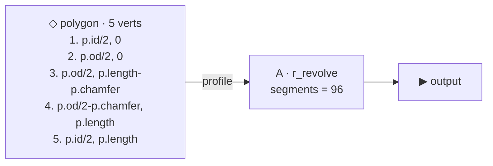

# g_collar

> Hollow chamfered collar — revolved half-section. 5 literal vertices,
> no loop. Showcases the plain vertex flow with parametric ƒ-popover
> expressions (`p.od/2 - p.chamfer`).

## Summary

A hollow tube with a chamfered bottom-outer corner, revolved 360°
around the z-axis. The polygon is FIVE literal vertices in (r, z) half-
section form — bore wall, OD wall, chamfered corner, bottom inner —
each coord wired via the ƒ-popover to a parametric expression.

Round 1 part 3. See [`g_spiral`](g_spiral.md) + [`g_star`](g_star.md)
for the loop-driven counterparts; this one is the literal-vertex
exemplar.

## Params

| Name | Default | Step | Notes |
|---|---|---|---|
| `od` | 1.0 | 0.05 | Outer diameter. |
| `id` | 0.4 | 0.05 | Inner diameter (bore). `id < od` for a non-collapsed wall. |
| `length` | 0.5 | 0.05 | Total height (z, drilling-down). |
| `chamfer` | 0.08 | 0.01 | 45° chamfer cut at the bottom-outer corner. |

## Graph



## Half-section

```
     bore               OD
  r=id/2 │              │ r=od/2
         │              │
  z=0 ───┼──────────────┤─── top
         │              │
         │              │
         │              ╲    ← chamfer at p.od/2 - p.chamfer, p.length
  z=L  ──┼───────────────╲── bottom
         ↑ axis (r=0)
```

The polygon implicitly closes from vertex 5 (`r=id/2, z=length`) back
to vertex 1 (`r=id/2, z=0`) along the bore wall — no explicit closing
vertex needed.

## File layout

- Source: `<volume>/primitives/basic/g_collar.asm.ts`
- Replaces: `basic/collar_taper` → moved to `archive/`.

## References

- [polygon-repeat-loop architecture](../../.claude/projects/-Users-neerajsethi-code-cadtrain/memory/polygon_repeat_loop_architecture.md)
- [g_* parts curated list](../../.claude/projects/-Users-neerajsethi-code-cadtrain/memory/g_star_parts_curated_list.md)
- Sister parts: [g_spiral](g_spiral.md), [g_star](g_star.md)
