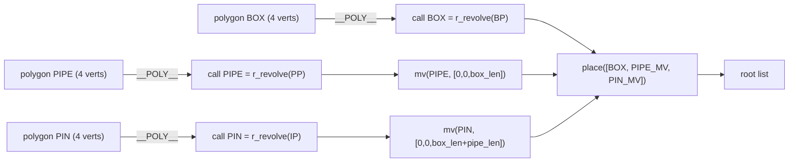

# g_dt_joint — Drill-pipe joint composition (box + pipe + pin)

A single graph that builds THREE separate revolved cylindrical sub-parts
(box on top, pipe in the middle, pin on the bottom) and composes them
along z via `place([…])`. Built as a graph-editor exemplar of a
**multi-(polygon → r_revolve) assembly** — three independent
(polygon, call) pairs co-existing in one graph, combined with `mv()`
offsets and `place()`.

## Coordinate convention

Z-down. Each sub-part is built in its own local frame at z = 0 .. its
own length, then `mv()` translates it to its slot in the joint:

| sub-part | local z-range  | placed at z |
|----------|----------------|-------------|
| BOX      | 0 .. box_len   | 0           |
| PIPE     | 0 .. pipe_len  | box_len     |
| PIN      | 0 .. pin_len   | box_len + pipe_len |

Final z-extent: 0 .. (box_len + pipe_len + pin_len).

## Composition

Six "core" nodes plus two mvs and a group:

* **n_gdtj1** polygon — BOX half-section (4 verts: bore × `box_len` × `box_od`).
* **n_gdtj3** polygon — PIPE half-section (4 verts: bore × `pipe_len` × `od`).
* **n_gdtj5** polygon — PIN half-section (4 verts: bore × `pin_len` × `pin_od`).
* **n_gdtj2** call — `r_revolve(BOX polygon, segments)` aliased `BOX`.
* **n_gdtj4** call — `r_revolve(PIPE polygon, segments)` aliased `PIPE`.
* **n_gdtj6** call — `r_revolve(PIN polygon, segments)` aliased `PIN`.
* **n_gdtj7** mv — PIPE translated by `[0, 0, p.box_len]`.
* **n_gdtj8** mv — PIN translated by `[0, 0, p.box_len + p.pipe_len]`.
* **n_gdtj9** group — `[BOX, mv(PIPE,...), mv(PIN,...)]`. Post-emit, this
  array literal is rewritten to `place([…])` (a `Manifold.compose` —
  topological combine, NO boolean union). Each part keeps its own colour
  via Manifold's mesh relation.

`place` was chosen over `stack` because `stack` would mate via tail/head
datums (relative offset); `place` honours the explicit `mv` offsets the
graph spells out.

## Parameters

| name     | default | range      | unit | controls |
|----------|---------|------------|------|----------|
| od       | 2.5     | 0.5 .. 20  | in   | PIPE outer diameter |
| bore     | 1.0     | 0 .. 20    | in   | shared bore (all 3 parts) |
| box_od   | 3.0     | 0.5 .. 20  | in   | BOX outer diameter |
| box_len  | 1.0     | 0.1 .. 10  | in   | BOX length |
| pipe_len | 4.0     | 0.5 .. 60  | in   | PIPE length (the "body") |
| pin_od   | 2.6     | 0.5 .. 20  | in   | PIN outer diameter |
| pin_len  | 0.8     | 0.1 .. 10  | in   | PIN length |
| segments | 64      | 8 .. 256   |      | circumferential resolution |

The "drill pipe" geometry is intentionally schematic — three concentric
cylinders. No upsets, no tapers, no threads. The point of this exemplar
is the **graph structure**, not the manufacturing detail; for real
drill-pipe geometry see `completions/drill_pipe/*` once those parts are
ported into the graph form.

## Validation

At default params the bake produces **verts=3840 · tris=1280 ·
z=0..5.8 · xy ≈ ±1.5** (1.5 = box_od/2). z=5.8 = box_len(1) +
pipe_len(4) + pin_len(0.8) — the placement math checks out.

## Graph topology

## Why this is a useful exemplar

* **Multiple (polygon → r_revolve) sub-graphs** in one assembly —
  demonstrates the editor can hold and lay out several independent
  visual sub-trees side-by-side.
* **`mv` with mixed ArgValue offsets** — `[literal, literal, param]` for
  PIPE and `[literal, literal, expr]` for PIN; exercises the offset
  array's per-slot ArgValue rendering.
* **Post-emit rewrite** — the graph emitter natively emits the root list
  composition as a `group` (a JS array literal). The build script
  rewrites the array to `place([…])`. Future: add a "group→place"
  node type to the graph schema so this rewrite isn't needed.

## Replaces

`basic/dt_joint` (archived 2026-06-11) — old version was a K.69
vocabulary-translated `joint` assembly that stacked external `dt_box +
dt_tube + dt_pin` calls via tail/head datums. g_dt_joint inlines all
three sub-part geometries into a single graph so the structure is
self-contained (no external `uses` beyond `r_revolve`).
