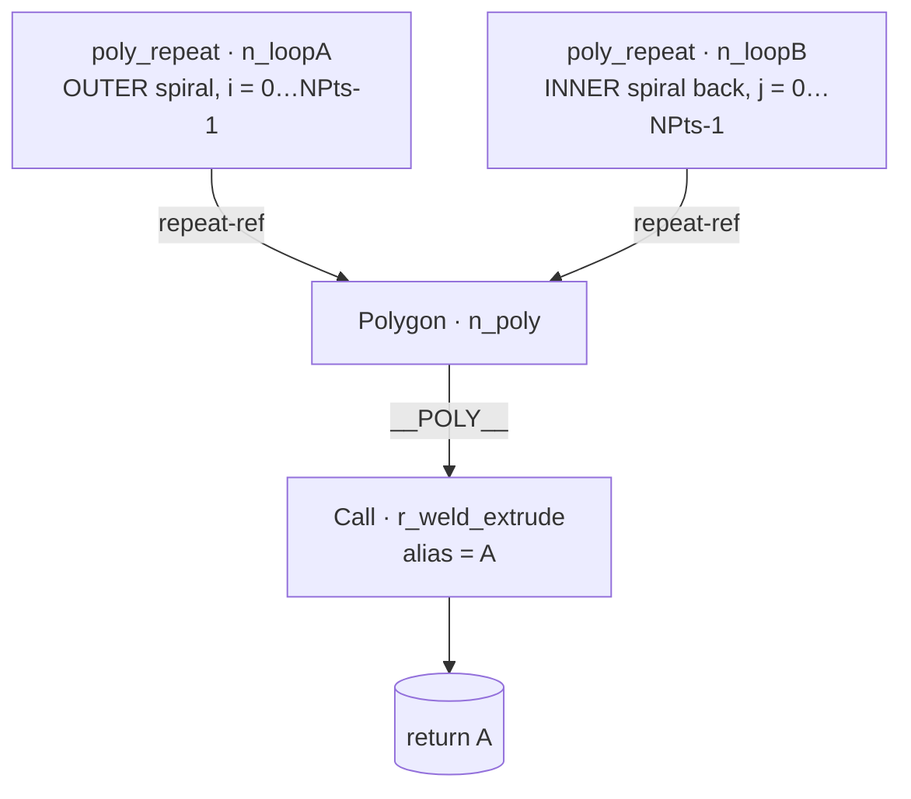

# g_spiral — Archimedean Spiral Strip

First of the `g_*` curated batch (see memory `g_star_parts_curated_list`).
Replaces the legacy `basic/spiral` part with a graph-authored equivalent
that showcases the polygon repeat-loop subsystem introduced in #157.

## What this represents

A thin flat coil — an Archimedean spiral strip extruded straight down z.
The cross-section (perpendicular to z) is the area enclosed between
**two concentric Archimedean spirals** offset by a constant radial
`width`: the outer spiral winds out from `r0` to `r0 + growth`, the
inner spiral winds back the same path at `R - width`. Walking the
combined polygon: out along the outer spiral (`i = 0 … NPts-1`), then
back along the inner spiral in reverse (`j = 0 … NPts-1` mapping to
`idx = NPts-1-j`). The resulting closed strip extrudes through
`r_weld_extrude` into a coil-shaped flat disc.

## Showcases (why this part exists)

* **TWO `poly_repeat` nodes feeding ONE polygon.** No literal vertices —
  the polygon `points[]` is two `{kind:'repeat-ref'}` entries, one per
  loop, interleaved in order. Each ref splices its loop's N points at
  its row position.
* **Auto-injected `NPts`.** Inside each loop arrow body the emitter
  prepends `const NPts = <count>;` so the bindings read naturally as
  `theta = i * turns * tau / NPts`.
* **Binding cascade (left-to-right).** `theta` references `turns +
  NPts`; `R` references `R0 + dr + NPts`; loop B's `idx` is referenced
  by both `theta` and `R`. The emitter emits bindings in order so each
  one can reference earlier scalars + `NPts`.
* **Wired `NPts` socket.** Both loops' `count` is `{kind:'param',
  param:'NPts'}` so a single dial drives both spirals' resolution.

## Coordinate convention

Z-down (top = lower z, bottom = higher z), inherited from
`r_weld_extrude`. The polygon lives in the (x, y) plane and is extruded
along `+z`. With `length = 0.4` the top of the coil sits at `z = 0`
and the bottom at `z = 0.4`. The spiral is 2D — neither axis maps to
"depth" in the wellbore sense; this part is an exemplar of the graph
editor, not a downhole component.

## Composition



Loop A — outer spiral going out:

```
NPts  = p.NPts
R0    = p.r0
dr    = p.growth
turns = p.turns
theta = i * turns * tau / NPts
R     = R0 + dr * i / NPts
x     = R * cos(theta)
y     = R * sin(theta)
```

Loop B — inner spiral coming back (reverse traversal, radius offset
inward by `width`):

```
NPts  = p.NPts
R0    = p.r0
dr    = p.growth
turns = p.turns
width = p.width
idx   = NPts - 1 - j
theta = idx * turns * tau / NPts
R     = R0 + dr * idx / NPts - width
x     = R * cos(theta)
y     = R * sin(theta)
```

The two repeat-ref entries in the polygon are walked in order, so the
final closed polygon is `[…loop A points…, …loop B points (reversed)…]`
— traversed counter-clockwise around the strip.

## Parameters

| name     | default | step | what it controls                                                                  |
|----------|--------:|-----:|-----------------------------------------------------------------------------------|
| `NPts`   |      60 | 1    | Vertices per spiral arm. Total polygon size is `2 * NPts`. Drives both loops.     |
| `r0`     |     0.4 | 0.05 | Starting radius of the outer spiral (first vertex of loop A).                     |
| `growth` |     1.0 | 0.05 | Radial growth across the full traversal (outer end radius = `r0 + growth`).       |
| `turns`  |     2   | 0.1  | Angular sweep, in turns. `2` = two full revolutions of `tau` radians each.        |
| `width`  |    0.06 | 0.01 | Constant radial offset between outer + inner spirals. Strip thickness in 2D.      |
| `length` |     0.4 | 0.05 | Extrusion depth along `+z`. The flat coil's thickness in 3D.                      |

## Default bake metrics

Verified against prod `/api/primitives/preview` with defaults
`[60, 0.4, 1.0, 2, 0.06, 0.4]`:

| metric    | value                  |
|-----------|------------------------|
| verts     | 1428 (render array)    |
| tris      | 476                    |
| z-extent  | 0.4 (matches `length`) |

## Validation rules

None yet. Sensible bounds (informally enforced by the dials):

* `NPts >= 3` — fewer is degenerate, the welded extrude will refuse.
* `growth > width` — when growth ≤ width the inner spiral overshoots
  the outer and the strip self-intersects. Manifold may still bake but
  the geometry isn't physical.
* `turns > 0` — zero turns degenerates to a radial line segment.

## Geometry contract

* `meta.id` stays `g_spiral`.
* `meta.kind` is `'asm'` — graph-authored. Saving via the editor will
  regenerate the body from `meta.graph` and overwrite the function
  definition (per the auto-generated banner). Hand edits to the body
  are discarded.
* `meta.uses` lists `r_weld_extrude` — the stdlib extrude primitive
  (Rule 21). Resolved by the loader from `src/lib/cad/stdlib/`.
* Function signature is `export function g_spiral(p)` (single object
  arg). The loader detects object-style via `sigNames.length === 1 &&
  metaKeys.length > 0` and passes a single bundled object so `p.NPts`
  etc. work.

## File layout

```
$APP_DATA_DIR/primitives/basic/g_spiral.asm.ts
```

The file is `.asm.ts` (not `.prim.ts`) because `meta.kind: 'asm'`
flagged it as an assembly — the graph editor's canonical output kind.

## References

* Memory `polygon_repeat_loop_architecture` — the polygon + poly_repeat
  data model + emit contract this part exercises.
* Memory `g_star_parts_curated_list` — the curated rollout this part
  opens.
* Volume exemplar `basic/try_new.prim.ts` — the source-shape pattern
  copied here.
* Wikipedia — Archimedean spiral (`r = a + b·θ`). Loop A's binding
  `R = R0 + dr * i / NPts` with `theta = i * turns * tau / NPts` is
  exactly that form parameterised by traversal fraction.
