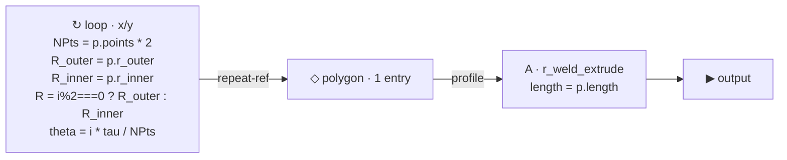

# g_star

> Cartesian-extrude star prism. One loop, alternating outer/inner
> radius, fed into `r_weld_extrude`. Showcases conditional bindings
> (`R = i%2 === 0 ? R_outer : R_inner`) inside the loop body.

## Summary

A regular N-pointed star, extruded straight down z. The cross-section
is built by ONE `poly_repeat` whose loop produces `2 * NPts` points
alternating between the outer and inner radii (one outer vertex + one
inner vertex per "star point"). The wired polygon → `r_weld_extrude`
gives a star prism with crisp sides.

This is the second `g_*` Round-1 part. See
[`docs/parts/g_spiral.md`](g_spiral.md) for the previous one + the
shared method (graph editor → meta.graph → emit → bake-verify).

## Params

| Name | Default | Step | Notes |
|---|---|---|---|
| `points` | 5 | 1 | Number of star points (visible). `NPts` inside the loop = `points * 2`. |
| `r_outer` | 1.0 | 0.05 | Outer-tip radius. |
| `r_inner` | 0.4 | 0.05 | Inner-valley radius. `r_inner < r_outer` for a proper star. |
| `length` | 0.6 | 0.05 | Extrusion depth (z, drilling-down). |

## Graph



## Binding cascade

```
i, NPts in scope from the start
  R_outer = p.r_outer
  R_inner = p.r_inner
  R       = i % 2 === 0 ? R_outer : R_inner   ← conditional
  theta   = i * tau / NPts
return [R * cos(theta), R * sin(theta)]
```

The `R = i%2 === 0 ? R_outer : R_inner` line is the central trick — a
binding with a JS ternary that branches per-iteration on the loop var,
without needing the user to write the full conditional inline in the
`x` and `y` expressions.

## File layout

- Source: `<volume>/primitives/basic/g_star.asm.ts` (graph-authored — `meta.kind:'asm'` → `.asm.ts` extension).
- Replaces: nothing (new exemplar).

## References

- [polygon-repeat-loop architecture](../../.claude/projects/-Users-neerajsethi-code-cadtrain/memory/polygon_repeat_loop_architecture.md)
- [g_* parts curated list](../../.claude/projects/-Users-neerajsethi-code-cadtrain/memory/g_star_parts_curated_list.md)
- Sister part: [g_spiral](g_spiral.md)
