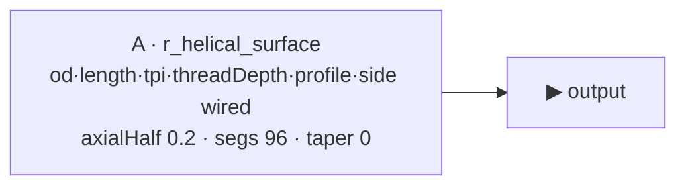

# helical_demo

> BARE THREAD demo — a single call to the [`r_helical_surface`](r_helical_surface.md)
> engine, nothing else, so you can SEE exactly what the thread engine makes on
> its own: one welded displacement surface, watertight, no CSG. Coarse + chunky
> by default (pitch 1.0, deep 0.3 V60 tooth) so the helix reads clearly. Lives
> on the volume at `primitives/basic/thread_grooves/helical_demo.asm.ts`.

## Why it exists

`r_helical_surface` is a read-only **stdlib engine**, not an editable part —
opening it directly in `/graph-editor?id=r_helical_surface` shows the
"read-only engine" banner with an empty canvas (engines have no `meta.graph`).
`helical_demo` is the minimal part that USES it, so opening it shows the thread
itself (3D bake) with dialable controls. It complements
[`pin_thread`](pin_thread.md) (external thread + shoulder = a pin) and
[`box_thread`](box_thread.md) (internal thread carved into a bore): those show
the engine COMPOSED into a connection; this shows the engine ALONE.

## Params

| Name | Default | Step | Notes |
|---|---|---|---|
| `od` | 3.2 | 0.125 | Outer (base/minor) Ø. Crest Ø = `od + 2·threadDepth` = 3.8. |
| `length` | 5 | 0.5 | Threaded length (z). |
| `tpi` | 1 | 0.1 | Threads per unit → pitch 1.0 (chunky, legible). |
| `threadDepth` | 0.3 | 0.01 | Radial tooth height (deep, so the thread reads clearly). |
| `profile` | V60 | enum | Tooth cross-section: Square / V60 / ACME. |
| `side` | External | enum | External = solid rod (ridges out). Internal = bore plug (ridges in — the negative you'd SUBTRACT from a tube). |

`axialHalf` (0.2), `segmentsPerTurn` (96) and `taper` (0) are fixed literals on
the call — advanced engine dials kept off the part's surface for legibility.

## Graph

One Call node, root-list with a single child → the function returns the thread
manifold directly (no compose). The six dialable params are wired
(`kind:'param'`); the three advanced ones are literals.

## Bake verification (2026-06-28)

WATERTIGHT at defaults. 173 376 verts · 57 792 tris · z-extent [0, 5] · radial
range [0, 1.9] (axis-centre cap → crest r = `od/2 + threadDepth` = 1.6 + 0.3).
Cutaway present (half-section shows the V60 tooth profile). Bakes byte-identical
from the stored `meta.graph` (2 nodes) — hydrates → re-emits → bakes.

## Build provenance

Authored against the editor-native graph schema (single `r_helical_surface`
Call, list root) and saved via `/api/primitives/save`; round-trips through
`GraphEditorPane` like any composed part. The engine itself is unchanged —
only its `meta` labels + `desc` tooltips were clarified (geometry byte-identical).
