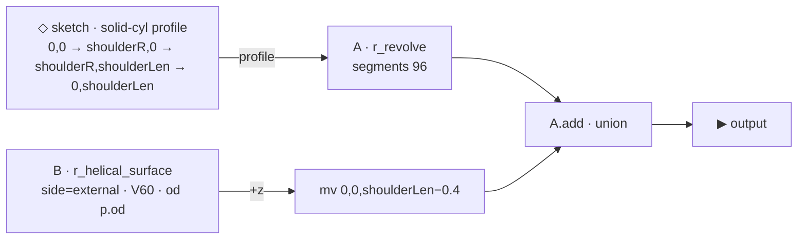

# pin_thread

> EXTERNAL thread demo (a pin) — a revolved shoulder + a helical thread ROD
> from the [`r_helical_surface`](r_helical_surface.md) engine (`side=external`).
> Coarse, legible demo (chunky 1-tpi pitch, deep 0.25 V60 tooth). Mates with
> [`box_thread`](box_thread.md). Lives on the volume at
> `primitives/basic/thread_grooves/pin_thread.asm.ts`.

## Summary

A fat round shoulder (head) at the top with a narrower threaded shank below —
the classic pin shape. The shank is the displacement-surface engine run as a
solid threaded rod; the shoulder is a plain revolved cylinder. They're unioned;
the threads are pushed down (Z-down: +z) so they emerge below the shoulder.

## Params

| Name | Default | Step | Notes |
|---|---|---|---|
| `length` | 4 | 0.5 | Thread length (z). |
| `od` | 2.7 | 0.1 | Thread base Ø → minor Ø 2.7, major Ø 3.2 (= `od + 2·depth`). |
| `tpi` | 1 | 0.1 | Turns per unit length → pitch 1.0. |
| `threadDepth` | 0.25 | 0.01 | Radial tooth height. |
| `shoulderR` | 2.0 | 0.05 | Shoulder (head) radius. |
| `shoulderLen` | 1.4 | 0.1 | Shoulder height (z). |

## Graph

- `r_helical_surface(side=0)` → a solid rod, valley r = `od/2`, crest
  r = `od/2 + depth`.
- `mv(thread, [0,0, shoulderLen − 0.4])` overlaps the thread top into the
  shoulder by 0.4 so the union is clean.
- `shoulder.add(thread)` — the shoulder (radius 2.0) reads as the head; the
  threaded shank (major Ø 3.2) is narrower, so the part reads as a pin.

## Mating with box_thread

| feature | pin | box (bore) |
|---|---|---|
| valley / minor | r 1.35 (Ø 2.7) | ridge tip r 1.35 (Ø 2.7) |
| crest / major | r 1.60 (Ø 3.2) | valley r 1.60 (Ø 3.2) |

Same `tpi`, `axialHalf`, `profile` (V60) and `length`, so the pin crest rides
in the box valley and the box ridge sits in the pin valley — they read as a
mating connection. (Visual demo, not a tolerance-cut functional fit.)

## Bake verification (2026-06-28)

WATERTIGHT. verts 126 966 · z-extent [0, 5] (shoulder z 0–1.4 + thread z 1.0–5.0)
· r-range [0, 2.0] (solid axis → shoulder rim) · cutaway 31 706 tris.
Round-trips: stored `meta.graph` (6 nodes) hydrates → re-emits with zero
validation errors → bakes byte-identically from the volume.

## Build provenance

Authored via the real graph emitter (`composition-emit.emitGraph`) so the
`meta.graph` block is editor-native — opens + edits + saves through
`GraphEditorPane` like any composed part.
